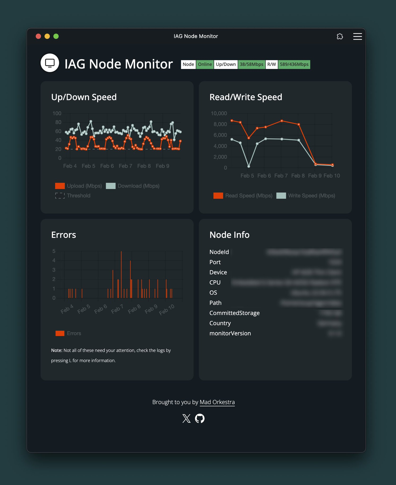

# IAG Node Monitor
Web Frontend to monitor the status and base metrics of your Iagon Storage Node CLI. 

Iagon is a decentralized Web3 cloud storage provider on Cardano: https://iagon.com/

       

## Requirements
- Iagon Storage Node CLI
 https://github.com/Iagonorg/mainnet-node-CLI

- NodeJS v18+ 
https://nodejs.org

# Installation
- Download the latest release from https://github.com/MadOrkestra/iagon-node-monitor/releases

- Unzip on the machine where your Iagon Node CLI is running
- Enter the directory and run `npm install`

- Add a free server port and paths to the Node CLI binary and the info.log to the .env.example file and rename it to .env

- Run `node server.js` in the monitor directory to start the the monitoring server

## Optional - Run persistent with PM2
To start the monitor on startup/after reboot, here is how to do this with PM2 (https://pm2.keymetrics.io/): 
- run `npm install pm2 -g` to install PM2
- run `pm2 startup` and follow the instructions to start PM2 on boot
- run `pm2 start server.js` in the monitor directory to start it
- run `pm2 save` to save your configuration

## Optional - SSL / Authentication
If you want to install the frontend as standalone Web App or need SSL / Authentication, Caddy is probably the easiest way: https://caddyserver.com/docs/quick-starts/reverse-proxy

# How to use

Open a webbrowser at http://[*IP of your Node*]:[*Server Port*] - that's it. If you run it with SSL (see above), you can install it as standalone web app. The interface is pretty straight forward and shows Node status, Bandwidth data, Read/Write speeds, errors over time and the Node logfile.

- Shortcuts
    - `L` to open the logfile view
    - `Escape` to close it
- Logs are pulled automatically from the logfile every 5 minutes
- Status is checked every 60 seconds

# Notes / Known Issues
- Depending on the size of your logfile this might take a while to startup. For performance reasons pings and ping requests are not shown in the logview.

- If you are running your Node on a public server, make sure to adapt your firewall settings accordingly or add authentication

- Not all errors displayed in the monitor need your attention, some are only of interest to Iagon. Check the logview for details.

- The charts get cluttered if your Node has been running for a while. Updating soon.

- This has a bunch of workarounds to get the infomation out of the Node and output it correctly, so it will most likely break after a Node update if Iagon decides to make changes to their logs.

- Tested on Ubuntu 22.04.3 LTS and MacOS Ventura. Other Linux distros will most likely work, but if you are running your Node on Windows, you'll have to figure it out on your own (please drop me a DM how it goes)

# What else?

I created this out of personal necessity and will keep updating it as long as I run my own Node. If you like it, feel free to send some ADA or IAG to my wallet at $madorkestra (https://handle.me/madorkestra) to keep me motivated.

Enjoy!